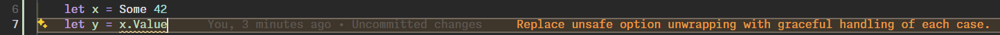

# Configuring for the IDE

Currently, analyzers are only supported in FsAutocomplete/Ionide, which is used by Visual Studio Code and other editors that support the Language Server Protocol (LSP).

## Visual Studio Code

In order to configure analyzers for VSCode, there are 2 ways. 

### Using NuGet Packages

For each project where you want to enable analyzers, add the following to your `.fsproj` file:

```xml  
<ItemGroup>
  <PackageReference Include="Ionide.Analyzers" Version="0.14.7" PrivateAssets="All" />
</ItemGroup>
```

or if using [Central Package Management](https://learn.microsoft.com/en-us/nuget/consume-packages/central-package-management) in your `Directory.Packages.props`: 

```xml
<ItemGroup>
  <PackageVersion Include="Ionide.Analyzers" Version="0.14.7" />
</ItemGroup>
```
and then reference it in your project files as:

```xml
<ItemGroup>
  <PackageReference Include="Ionide.Analyzers" PrivateAssets="All" />
</ItemGroup>
```

**NOTE**: The `PrivateAssets="All"` is important to ensure that the analyzer package does not get included in your published application. See [Controlling dependency assets](https://learn.microsoft.com/en-us/nuget/consume-packages/package-references-in-project-files#controlling-dependency-assets) for more information.

After adding the package reference, you may need to do a `dotnet restore` to force FsAutocomplete to pick up the new analyzers for a specific project.

### Configure a predefined path

This is useful if you're using `paket` to install analyzers to a specific directory in your project or have custom built analyzers to test against.

You will need to update your project's `.vscode/settings.json` file or your user settings. You should need the settings shown below.

```json
{
  "FSharp.enableAnalyzers": true,
  "FSharp.analyzersPath": ["path/to/analyzers/directory"]
}
```

After saving your new settings, FsAutocomplete should try to reload analyzers.

---


 You should be able to test and see if the analyzers are working by opening a F# file in your workspace and entering the following code.



[Next]({{fsdocs-next-page-link}})

If not, you can enable `FSharp.verboseLogging`, restart VSCode, then open the Output pane (1) with the `F#` output channel selected (2).

```json
{
  "FSharp.verboseLogging": true
}
```

You can then search (Cmd/Ctrl+F while in the Output pane) for `FsAutoComplete.Analyzer` (3) prefix in the log to see if analyzers are being loaded correctly.

